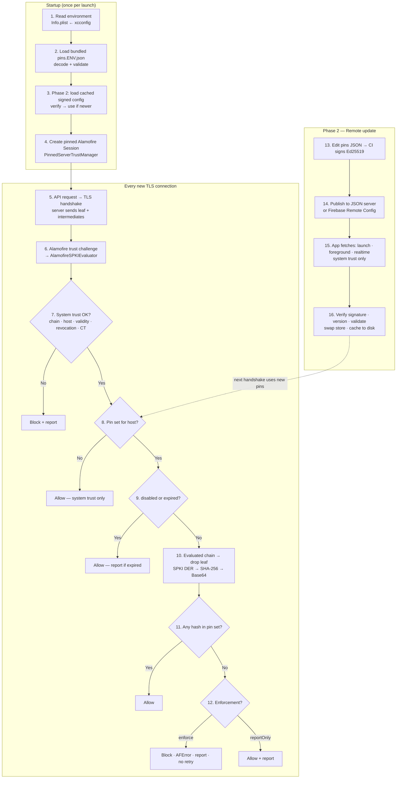

# iOS SPKI (CA-Level) Pinning — Implementation Plan

> **Status:** Plan (for plan mode) · **Date:** September 2026
> **Min target:** iOS 16 · **Networking today:** Alamofire-based API client **inside the app project**
> **Pinning today:** bundled keys/certificates + an Alamofire trust **evaluator** (to be confirmed in §2.6)
> **Preferred structure:** new local Swift package `NetworkTrust` (pending feasibility check in §3)
> **Phases:** Phase 1 = bundled SPKI CA pins replacing the current evaluator · Phase 2 = remote pin updates via JSON server or Firebase Remote Config

---

## How to use this document (instructions for the planning agent)

1. **Do Phase 0 discovery first (§2). Read-only — no code changes.**
2. **Understand and document the current pinning implementation (§2.6)** — evaluator type, bundled key/cert files, which chain position they pin, and the risk table.
3. Fill in the **Project Findings** table (§2.7) directly in this file.
4. Run the **SPM feasibility check (§3)** and record the decision in this file.
5. **Update every path, type name, target name and build configuration** in §5–§14 to match the real project. Delete assumptions that don't hold and note why.
6. Resolve or carry forward **Open Questions (§20)**.
7. Present the updated plan for approval **before** implementing.

Hard rules while planning and implementing:
- One approach only: **SPKI pinning of CA-level certificates** (see §1). Don't add leaf pinning, ATS `NSPinnedDomains`, or a separate URLSession-delegate implementation.
- Don't change request/response behavior of the existing API client beyond adding pinning.
- Don't upgrade Alamofire unless discovery proves it's required. If so, flag it as a separate decision.
- **Never invent SPKI hash values.** Generate them with §15 scripts only.
- Keep changes additive and reviewable. Suggested PR order is in §21.

---

## 1. The Approach (single)

**Pin the SHA-256 of the SubjectPublicKeyInfo (SPKI) of CA-level certificates (roots / intermediates) from at least two CAs, evaluated inside Alamofire's server trust hook, after full system trust evaluation.**

| Included | Why |
|---|---|
| System trust first (`SecTrustEvaluateWithError`) — chain, hostname, validity, revocation, **Certificate Transparency** | Pinning only narrows trust, never widens it. CT is enforced by iOS. |
| SPKI hashes of **CA-level** certs | Survives leaf renewals (≤200 days now, 99 days from 15 Mar 2027) |
| **≥2 CAs** in every enforced pin set (DigiCert G5 + transition roots + backup CA) | Avoids single-CA lock-in during CA incidents/hierarchy changes |
| Pin set **expiry** → fail open to system trust + report | Old app versions can't brick themselves |
| **Signed remote pin config** with `enforce` / `reportOnly` / `disabled` (**Phase 2**) | Update pins or kill-switch without an App Store release |
| Failure reporting | Detect breakage before users do |

| Explicitly out of scope | Reason |
|---|---|
| Leaf certificate pinning | Rotation too frequent |
| Pinning a single root (e.g. only DigiCert G5) | CA lock-in; DigiCert itself advises against pinning public roots |
| ATS `NSPinnedDomains` | Static, no expiry, no kill switch, no telemetry |
| Custom trust anchors (`SecTrustSetAnchorCertificates`) in app code | Replaces public trust store guarantees. Tests only. |
| WKWebView, third-party SDK networking, `URLSession.shared` traffic | Not the API client. Document, don't pin. |
| Jailbreak / hooking protection | Separate concern (App Attest etc.) |

### DigiCert G5 timeline (drives the pin set)

| Date | Change | Impact |
|---|---|---|
| 15 May 2026 | Two G5 cross-signed roots revoked (done) | Chains relying on old cross-signs changed |
| **15 Oct 2026** | **G5 becomes DigiCert's default issuance** (new, renew, reissue) | G2/G3-only pins break on next renewal |
| 28 Feb 2027 | G2/G3 cert validity truncated to end by 14 Sep 2027 | G2/G3 pins removable after all certs reissued |
| 15 Mar 2027 | Industry max TLS validity → 99 days | More chain churn |

### Phases

| Phase | Scope | Pin source | Safety net |
|---|---|---|---|
| **0** | Discovery, document current pinning, update this plan | — | — |
| **1** | Replace current Alamofire evaluator with the SPKI CA evaluator | Bundled `pins.<env>.json` in app | ≥2 CAs, pin-set expiry (fail open to system trust), failure reports |
| **2** | Remote pin updates + kill switch | Signed JSON from a **JSON server** or **Firebase Remote Config** | Ed25519 signature, monotonic version, verified disk cache |

---

## 1A. How Pinning Works — Step by Step

The numbers match the block diagram shared with the team.



| # | What happens | How (code) |
|---|---|---|
| 1 | Pick environment (development / staging / production) | `PinEnvironment.fromInfoPlist()` reads `NetworkTrustEnvironment` set from xcconfig (§14) |
| 2 | Load the pins shipped in the app | `PinConfiguration.load(contentsOf:)` + `validate()` (§6) |
| 3 | *(Phase 2)* Prefer a newer, previously downloaded config | `RemotePinConfigurationLoader.loadCached` re-verifies signature from disk (§10) |
| 4 | Build one long-lived Alamofire `Session` with our trust manager | `PinnedServerTrustManager` → `AlamofireSPKIEvaluator` (§13) |
| 5 | App calls API; iOS starts TLS; server presents leaf + intermediates | Existing API client, unchanged |
| 6 | Alamofire asks the trust manager for an evaluator for this host | `serverTrustEvaluator(forHost:)` returns the SPKI evaluator for every host |
| 7 | **System trust first** — chain to Apple root store, hostname, validity, revocation, Certificate Transparency | `SecTrustSetPolicies` + `SecTrustEvaluateWithError` (§8). Fail → block |
| 8 | Find the most specific pin set for the host | `PinConfiguration.pinSet(forHost:)` (§6). None → allow (system trust) |
| 9 | Kill switch / expiry checks | `.disabled` → allow; `expiresAt` passed → allow + report (fail open) |
| 10 | Hash CA-level keys of the **evaluated** chain (includes root anchor) | `SecTrustCopyCertificateChain` → drop leaf → `SPKIExtractor` → SHA-256 → Base64 (§7) |
| 11 | Compare against pin set | `Set.isDisjoint(with:)` — any match → allow |
| 12 | Mismatch handling | `enforce` → throw `AFError.serverTrustEvaluationFailed`, report, API client must not retry; `reportOnly` → allow + report (§11, §13) |
| 13 | *(Phase 2)* Ops change pins, CI signs payload | `scripts/sign-pin-config.py` (§10) |
| 14 | *(Phase 2)* Publish envelope | Static JSON on server/CDN **or** Firebase Remote Config parameter (§10) |
| 15 | *(Phase 2)* App fetches update over system trust (never via pinned session) | `HTTPPinConfigurationSource` or `FirebasePinConfigurationSource` (+ realtime listener) |
| 16 | *(Phase 2)* Verify and hot-swap pins; next handshake uses them | `PinConfigurationVerifier` → `PinConfigurationStore.replace` → cache file |

---

## 2. Phase 0 — Discovery (read-only)

Run from repo root. Adjust names once the workspace/project is known. Use `rg` if available, otherwise `grep -rn`.

### 2.1 Project & dependency management

```bash
# Workspaces, projects, package manifests, dependency managers
find . -maxdepth 4 \( -name "*.xcworkspace" -o -name "*.xcodeproj" -o -name "Package.swift" \
  -o -name "Podfile" -o -name "Podfile.lock" -o -name "Cartfile" -o -name "Cartfile.resolved" \
  -o -name "project.yml" -o -name "Project.swift" -o -name "Tuist" \) \
  -not -path "*/Pods/*" -not -path "*/.build/*" -not -path "*/DerivedData/*"

# Targets, build configurations, schemes
xcodebuild -list -workspace <Name>.xcworkspace   # or: xcodebuild -list -project <Name>.xcodeproj

# Existing local / remote SPM packages referenced by the project
rg -n "XCLocalSwiftPackageReference|XCRemoteSwiftPackageReference" --glob "*.pbxproj"
find . -name "Package.resolved" -not -path "*/.build/*" | xargs -I{} sh -c 'echo "== {}"; cat "{}"'

# How Alamofire is integrated + version
rg -n "Alamofire" --glob "Podfile*" --glob "Cartfile*" --glob "Package.resolved" --glob "*.pbxproj" | head -50
```

### 2.2 Build settings

```bash
rg -n "IPHONEOS_DEPLOYMENT_TARGET" --glob "*.pbxproj" --glob "*.xcconfig" | sort | uniq -c
rg -n "SWIFT_VERSION|SWIFT_STRICT_CONCURRENCY|SWIFT_UPCOMING_FEATURE" --glob "*.pbxproj" --glob "*.xcconfig" | sort | uniq -c
find . -name "*.xcconfig" -not -path "*/Pods/*"
```

### 2.3 API client & networking surface

```bash
# Where Alamofire Sessions are created / used
rg -n --type swift "import Alamofire" -l
rg -n --type swift "Session\(|Session\.default|\bAF\.|ServerTrustManager|ServerTrustEvaluating|PinnedCertificatesTrustEvaluator|PublicKeysTrustEvaluator|RequestInterceptor|EventMonitor|RetryPolicy"

# Other networking that would bypass the API client
rg -n --type swift "URLSession\.shared|URLSession\(configuration|WKWebView|SecTrust"

# ATS / existing pinning config
rg -n "NSAppTransportSecurity|NSPinnedDomains|NSExceptionDomains" --glob "*.plist"

# Environment base URLs and how they're selected
rg -n --type swift "baseURL|BASE_URL|apiHost|Environment" | head -80
rg -n "BASE_URL|API_HOST|_URL\s*=" --glob "*.xcconfig" --glob "*.plist"
```

### 2.4 Tests & CI

```bash
find . -maxdepth 3 \( -name "fastlane" -o -name ".github" -o -name "bitrise.yml" -o -name ".gitlab-ci.yml" \
  -o -name "Jenkinsfile" -o -name "codemagic.yaml" -o -name ".swiftlint.yml" \) -not -path "*/Pods/*"
rg -n "Tests" --glob "*.pbxproj" | rg "productType|PBXNativeTarget" | head
```

### 2.5 Live certificate chains (per environment API host)

```bash
scripts/spki-hashes.sh <prod-api-host>
scripts/spki-hashes.sh <staging-api-host>
```

### 2.6 Current pinning implementation (understand before changing)

> Reported by the team: pinning currently uses bundled **keys** and an Alamofire **evaluator**.
> Note: SSH keys are not part of TLS — confirm whether the project bundles **SSL/TLS certificate files** (`.cer` / `.der` / `.crt` / `.pem`) or raw **public keys**, and **which certificate in the chain** (leaf, intermediate, root) they correspond to.

#### Find it

```bash
# Evaluators and trust manager in use
rg -n --type swift "PinnedCertificatesTrustEvaluator|PublicKeysTrustEvaluator|DefaultTrustEvaluator|RevocationTrustEvaluator|CompositeTrustEvaluator|DisabledTrustEvaluator|ServerTrustManager|ServerTrustEvaluating|allHostsMustBeEvaluated|performDefaultValidation|validateHost"

# How keys/certificates are loaded
rg -n --type swift "af\.certificates|af\.publicKeys|SecCertificateCreateWithData|SecKeyCreateWithData|SecCertificateCopyKey|paths\(forResourcesOfType|urls\(forResourcesWithExtension"

# Certificate / key files in the repo (excluding dependencies)
find . \( -name "*.cer" -o -name "*.der" -o -name "*.crt" -o -name "*.pem" \) \
  -not -path "*/Pods/*" -not -path "*/.build/*" -not -path "*/DerivedData/*" -not -path "*/Carthage/*"

# Which targets bundle them (Copy Bundle Resources)
rg -n "\.cer|\.der|\.crt|\.pem" --glob "*.pbxproj"
```

#### Identify each bundled certificate

```bash
for f in <paths from find>; do
  echo "== $f"
  if openssl x509 -inform der -in "$f" -noout >/dev/null 2>&1; then FMT=der; else FMT=pem; fi
  openssl x509 -inform "$FMT" -in "$f" -noout -subject -issuer -enddate -ext basicConstraints 2>/dev/null
  printf 'SPKI: '
  openssl x509 -inform "$FMT" -in "$f" -noout -pubkey \
    | openssl pkey -pubin -outform der | openssl dgst -sha256 -binary | openssl enc -base64
done
```

- `CA:TRUE` → intermediate or root. No basicConstraints / `CA:FALSE` → **leaf**.
- Compare the `SPKI:` values with §2.5 live chain output to see which chain position is pinned today.

#### How Alamofire's built-in evaluators behave (reference)

| Evaluator | Passes when | Typical setup | Risk |
|---|---|---|---|
| `PinnedCertificatesTrustEvaluator` | Default validation + host check (if enabled), **and** a server chain certificate is **byte-identical** to a bundled certificate | `certificates: Bundle.main.af.certificates` | Any reissue of that certificate breaks, even with the same key |
| `PublicKeysTrustEvaluator` | Default validation + host check (if enabled), **and** a public key in the server chain equals a key extracted from bundled certificates | `keys: Bundle.main.af.publicKeys` | If the bundled cert is the leaf → breaks on key rotation; single-CA lock-in |
| `DisabledTrustEvaluator` | Always | Debug only | Must never reach Release |
| `ServerTrustManager(allHostsMustBeEvaluated: true, …)` | Hosts not listed in `evaluators` **fail** | Per-host dictionary | Behavior changes if we route all hosts through one evaluator |

> `Bundle.main.af.certificates` / `.publicKeys` load **every** `.cer/.crt/.der` in the main bundle — unrelated certificate files silently become pins.

#### Current vs target (fill in the Current column)

| Aspect | Current | Target |
|---|---|---|
| What is pinned | _TBD — leaf / intermediate / root; cert bytes or public key_ | SPKI SHA-256 of CA-level certs, ≥2 CAs |
| Where pins live | _TBD — cert files in bundle?_ | `pins.<env>.json` (Phase 1) + signed remote config (Phase 2) |
| Evaluator | _TBD — PinnedCertificates / PublicKeys / custom_ | `AlamofireSPKIEvaluator` via `PinnedServerTrustManager` |
| Hosts covered / `allHostsMustBeEvaluated` | _TBD_ | Pin sets per host; unpinned hosts → system trust |
| `performDefaultValidation` / `validateHost` | _TBD_ | Always on (system trust step 7) |
| Per-environment pins | _TBD_ | Env JSON selected by xcconfig |
| Rotation | App release | Phase 1: release · Phase 2: remote |
| Expiry / fail-safe | _TBD (likely none)_ | Per pin set |
| Kill switch | _TBD (likely none)_ | Phase 2 |
| Telemetry | _TBD (likely generic AFError)_ | Reports with presented SPKIs |

#### DigiCert G5 impact on the **current** implementation

| If today's pin is… | What happens |
|---|---|
| Leaf certificate / leaf key | Breaks at next renewal regardless of G5; renewals get more frequent (99 days from 15 Mar 2027) |
| DigiCert G2/G3 **intermediate** | Breaks when the server cert is renewed under G5 (default from 15 Oct 2026) |
| DigiCert Global Root G2/G3 key | Breaks once the chain moves to G5, unless the device still builds a path through a G2/G3 cross-sign |
| Non-DigiCert CA | Unaffected by G5, still single-CA lock-in |

> ⚠️ **Installed old app versions keep today's pinning.** Before the backend renews under G5, decide with backend: (a) explicitly select the G2/G3 hierarchy on the next renewal (DigiCert still allows explicit selection after 15 Oct 2026; such certs are truncated to end by 14 Sep 2027), (b) force-update versions below the Phase 1 release, or both. Record the decision in §20.

### 2.7 Project Findings (fill in)

| Item | Finding |
|---|---|
| Workspace / project file | _TBD_ |
| Project generator (none / XcodeGen / Tuist) | _TBD_ |
| App targets + extensions that call the API | _TBD_ |
| Build configurations → environment mapping | _TBD_ (e.g. `Debug-Dev`→development, `Release-Staging`→staging, `Release`→production) |
| Deployment target(s) found | _TBD_ (expected iOS 16) |
| Swift version / strict concurrency level | _TBD_ |
| Alamofire integration (SPM / CocoaPods / Carthage / vendored) + version | _TBD_ |
| Existing local SPM packages? | _TBD_ |
| API client folder path | _TBD_ |
| File(s) creating Alamofire `Session` | _TBD_ |
| Uses of `AF.` / `Session.default` | _TBD_ (count + files) |
| Existing interceptor / retrier / event monitors on the Session | _TBD_ |
| Existing pinning or ATS exceptions | _TBD_ |
| Current evaluator type(s) + `ServerTrustManager` setup | _TBD_ (from §2.6) |
| Bundled cert/key files, targets, chain position | _TBD_ (from §2.6) |
| Old-version protection decision (G2/G3 selection / force update) | _TBD_ |
| Firebase integrated? (Remote Config available?) | _TBD_ (for Phase 2) |
| `URLSession.shared` / other networking to API hosts | _TBD_ |
| API hosts per environment | _TBD_ |
| Current CA chain per host (from §2.5) | _TBD_ (e.g. DigiCert Global Root G2 → …) |
| Test targets | _TBD_ |
| CI system + where tests run | _TBD_ |
| SwiftLint present? | _TBD_ |
| Existing crash/analytics tool for non-fatal events | _TBD_ |

---

## 3. Feasibility — Local SPM Package vs In-App Folder

### Preferred design

- **`NetworkTrust` local Swift package: code only, zero third-party dependencies** (Foundation, Security, CryptoKit, os).
- **Alamofire adapter lives in the app, next to the existing API client.**
- **Pin JSON files live in the app target(s)** so each app/target can own its hosts.

Why the package must **not** depend on Alamofire: if Alamofire comes via CocoaPods (or a different SPM version), a package dependency on it would introduce a second copy / version conflict. Keeping the package dependency-free sidesteps this entirely regardless of how Alamofire is integrated.

### Go / No-go checklist for SPM

| Check | Go if |
|---|---|
| Xcode version used locally and on CI | Supports local packages (any modern Xcode) |
| Project generator | None, **or** XcodeGen/Tuist spec can declare a local package (update the spec, not the `.pbxproj`) |
| CI build command | Builds via workspace/project that resolves SPM packages (xcodebuild / fastlane gym do) |
| CocoaPods present | Fine — package has no pod dependencies |
| Multiple app targets/extensions use API client | Link `NetworkTrust` product to each of them |
| Deployment target | Package declares `.iOS(.v16)`; must be ≤ every consuming target |
| Strict concurrency setting | Package compiles cleanly under the project's Swift language mode |

**If Go:** create `Packages/NetworkTrust` (path adjustable), add as local package, link to targets.
**If No-go:** put the same sources in a `NetworkTrust/` group inside the app target (or an existing shared framework target). Only change: types can be `internal`, and tests move to the app's test target. Record the blocker in this file.

---

## 4. Pin Set Content

| Pin (SPKI SHA-256, Base64) | Role | Remove when |
|---|---|---|
| DigiCert TLS RSA4096 Root G5 | Primary, go-forward (RSA certs) | — |
| DigiCert TLS ECC P384 Root G5 | Primary, go-forward (ECC certs) | — |
| DigiCert Global Root G2 | Transition + cross-sign paths on older devices | All certs reissued under G5 **and** reports show no G2-only chains |
| DigiCert Global Root G3 | Transition | Same as G2 |
| Backup CA root(s) | Emergency CA switch | Never — **only valid if backend has a standby cert from that CA** |

Notes:
- Adjust after §2.5 — if a host is **not** on DigiCert today, the primary/transition rows change.
- Root pins work because the evaluator hashes the **evaluated** chain (`SecTrustCopyCertificateChain` after evaluation), which includes the trust anchor even though servers don't send it.
- Pin **first-party API hosts only**. No CDNs, analytics, auth providers or other third parties.

---

## 5. Target Layout (adjust paths after §2/§3)

```
Packages/NetworkTrust/                                  ← new local package
├── Package.swift
├── Sources/NetworkTrust/
│   ├── Model/PinSet.swift                              C1
│   ├── Model/PinConfiguration.swift                    C1
│   ├── Model/PinEnvironment.swift                      C1
│   ├── Crypto/DERReader.swift                          C2
│   ├── Crypto/SPKIExtractor.swift                      C2
│   ├── Crypto/SPKIHasher.swift                         C2
│   ├── Evaluation/TrustDecision.swift                  C3
│   ├── Evaluation/PinningTrustEvaluator.swift          C3
│   ├── Config/PinConfigurationStore.swift              C4
│   ├── Config/PinConfigurationVerifier.swift           C5 (Phase 2)
│   ├── Config/PinConfigurationSource.swift             C5 (Phase 2) protocol + HTTP source
│   ├── Config/RemotePinConfigurationLoader.swift       C5 (Phase 2)
│   ├── Reporting/PinFailureReporter.swift              C6
│   └── NetworkTrust.swift                              C7
├── Tests/NetworkTrustTests/
│   ├── Fixtures/
│   └── *.swift
└── scripts/
    ├── spki-hashes.sh
    ├── make-test-pki.sh
    └── sign-pin-config.py                              (Phase 2)

<App>/<APIClientFolder>/Security/                       ← app side (exact path from §2.7)
├── AlamofireSPKIEvaluator.swift                        C8
├── PinnedServerTrustManager.swift                      C8
├── AppNetworkTrust.swift                               C8 (bootstrap)
└── FirebasePinConfigurationSource.swift                C5 (Phase 2, only if Firebase is chosen)

<App>/Resources/NetworkTrust/                           ← app side
├── pins.development.json                               C1
├── pins.staging.json
└── pins.production.json
```

### Package.swift

```swift
// swift-tools-version:5.9
import PackageDescription

let package = Package(
    name: "NetworkTrust",
    platforms: [
        .iOS(.v16),
        .macOS(.v13)   // lets `swift test` run on CI/Mac without a simulator
    ],
    products: [
        .library(name: "NetworkTrust", targets: ["NetworkTrust"])
    ],
    targets: [
        .target(name: "NetworkTrust"),
        .testTarget(
            name: "NetworkTrustTests",
            dependencies: ["NetworkTrust"],
            resources: [.copy("Fixtures")]
        )
    ]
)
```

---

## 6. C1 — Pin Model

### PinSet.swift

```swift
import Foundation

public enum PinEnforcement: String, Codable, Sendable {
    /// Mismatch blocks the request.
    case enforce
    /// Mismatch is reported, request allowed (rollout / canary).
    case reportOnly
    /// Pinning skipped for this domain (remote kill switch). System trust still applies.
    case disabled
}

public struct PinSet: Codable, Sendable, Equatable {
    public let domain: String
    public let includeSubdomains: Bool
    /// Base64(SHA-256(DER SubjectPublicKeyInfo)) of CA / sub-CA certificates.
    public let spkiSHA256Base64: Set<String>
    /// After this date the set is ignored (fail open to system trust) and reported.
    public let expiresAt: Date
    public let enforcement: PinEnforcement

    public init(domain: String, includeSubdomains: Bool, spkiSHA256Base64: Set<String>,
                expiresAt: Date, enforcement: PinEnforcement) {
        self.domain = domain
        self.includeSubdomains = includeSubdomains
        self.spkiSHA256Base64 = spkiSHA256Base64
        self.expiresAt = expiresAt
        self.enforcement = enforcement
    }

    func matches(host: String) -> Bool {
        let pinnedDomain = self.domain.lowercased()
        return host == pinnedDomain || (includeSubdomains && host.hasSuffix("." + pinnedDomain))
    }
}
```

### PinConfiguration.swift

```swift
import Foundation

public enum PinConfigurationError: Error, Equatable {
    case invalid(String)
    case unknownSigningKey
    case badSignature
    case notNewer
    case issuedInFuture
}

public struct PinConfiguration: Codable, Sendable, Equatable {
    /// Monotonic. Remote configs must be strictly newer than what is loaded.
    public let version: Int
    public let issuedAt: Date
    public let pinSets: [PinSet]

    public init(version: Int, issuedAt: Date, pinSets: [PinSet]) {
        self.version = version
        self.issuedAt = issuedAt
        self.pinSets = pinSets
    }

    /// Most specific matching domain wins.
    public func pinSet(forHost host: String) -> PinSet? {
        pinSets.filter { $0.matches(host: host) }.max { $0.domain.count < $1.domain.count }
    }

    public func validate() throws {
        for set in pinSets {
            guard !set.domain.isEmpty else { throw PinConfigurationError.invalid("Empty domain") }
            for pin in set.spkiSHA256Base64 {
                guard Data(base64Encoded: pin)?.count == 32 else {
                    throw PinConfigurationError.invalid("\(set.domain): pin is not a Base64 SHA-256 digest")
                }
            }
            guard set.enforcement != .disabled else { continue }
            guard set.spkiSHA256Base64.count >= 2 else {
                throw PinConfigurationError.invalid("\(set.domain): needs ≥2 pins (primary + backup CA)")
            }
            guard set.expiresAt > issuedAt else {
                throw PinConfigurationError.invalid("\(set.domain): expiresAt must be after issuedAt")
            }
        }
    }

    /// Loads a bundled (unsigned) pin file shipped inside the app.
    public static func load(contentsOf url: URL) throws -> PinConfiguration {
        let config = try JSONDecoder.pinning.decode(PinConfiguration.self, from: Data(contentsOf: url))
        try config.validate()
        return config
    }
}

extension JSONDecoder {
    static var pinning: JSONDecoder {
        let decoder = JSONDecoder()
        decoder.dateDecodingStrategy = .iso8601
        return decoder
    }
}

extension JSONEncoder {
    static var pinning: JSONEncoder {
        let encoder = JSONEncoder()
        encoder.dateEncodingStrategy = .iso8601
        encoder.outputFormatting = [.sortedKeys]
        return encoder
    }
}
```

### PinEnvironment.swift

```swift
import Foundation

public enum PinEnvironment: String, Sendable {
    case development, staging, production

    /// Missing or unknown value → production (strictest).
    public static func fromInfoPlist(_ bundle: Bundle = .main) -> PinEnvironment {
        (bundle.object(forInfoDictionaryKey: "NetworkTrustEnvironment") as? String)
            .flatMap(PinEnvironment.init(rawValue:)) ?? .production
    }
}
```

### App resource: pins.production.json

Hashes are **placeholders on purpose** — generate with §15.

```json
{
  "version": 1,
  "issuedAt": "2026-09-17T00:00:00Z",
  "pinSets": [
    {
      "domain": "<prod-api-host>",
      "includeSubdomains": false,
      "enforcement": "reportOnly",
      "expiresAt": "2027-06-30T00:00:00Z",
      "spkiSHA256Base64": [
        "REPLACE_DigiCert_TLS_RSA4096_Root_G5",
        "REPLACE_DigiCert_TLS_ECC_P384_Root_G5",
        "REPLACE_DigiCert_Global_Root_G2",
        "REPLACE_DigiCert_Global_Root_G3",
        "REPLACE_BACKUP_CA_ROOT"
      ]
    }
  ]
}
```

`pins.development.json` may use `"enforcement": "disabled"` so Proxyman/Charles work. Pinning code is **never** compiled out with `#if DEBUG`; the environment file decides.

---

## 7. C2 — SPKI Extraction & Hashing

Parse certificate DER and hash the **exact** `SubjectPublicKeyInfo` TLV bytes. Matches `openssl x509 -pubkey | openssl pkey -pubin -outform der | sha256` for all key types. (Rejected: `SecKeyCopyExternalRepresentation` + hardcoded ASN.1 headers — brittle per key size/curve.)

### DERReader.swift

```swift
import Foundation

enum SPKIError: Error, Equatable {
    case malformedDER
    case unexpectedTag(UInt8)
}

/// Minimal DER reader — just enough to walk X.509 TBSCertificate.
struct DERReader {
    struct TLV {
        let tag: UInt8
        let encoded: ArraySlice<UInt8>   // tag + length + value
        let value: ArraySlice<UInt8>
    }

    private var remaining: ArraySlice<UInt8>

    init(_ bytes: ArraySlice<UInt8>) { remaining = bytes }

    var nextTag: UInt8? { remaining.first }

    mutating func read(expectedTag: UInt8? = nil) throws -> TLV {
        let start = remaining.startIndex
        let end = remaining.endIndex
        guard start < end else { throw SPKIError.malformedDER }

        let tag = remaining[start]
        if let expectedTag, tag != expectedTag { throw SPKIError.unexpectedTag(tag) }

        var cursor = start + 1
        guard cursor < end else { throw SPKIError.malformedDER }
        let lengthByte = remaining[cursor]
        cursor += 1

        var length = 0
        if lengthByte & 0x80 == 0 {
            length = Int(lengthByte)
        } else {
            let count = Int(lengthByte & 0x7F)
            guard (1...4).contains(count), cursor + count <= end else { throw SPKIError.malformedDER }
            for i in 0..<count { length = (length << 8) | Int(remaining[cursor + i]) }
            cursor += count
        }

        let valueEnd = cursor + length
        guard valueEnd <= end else { throw SPKIError.malformedDER }

        let tlv = TLV(tag: tag, encoded: remaining[start..<valueEnd], value: remaining[cursor..<valueEnd])
        remaining = remaining[valueEnd..<end]
        return tlv
    }

    mutating func skip() throws { _ = try read() }

    mutating func enter(expectedTag: UInt8) throws -> DERReader {
        DERReader(try read(expectedTag: expectedTag).value)
    }
}
```

### SPKIExtractor.swift

```swift
import Foundation

enum SPKIExtractor {
    /// Certificate ::= SEQUENCE { tbsCertificate, signatureAlgorithm, signature }
    /// TBSCertificate ::= SEQUENCE { [0] version OPTIONAL, serialNumber, signature,
    ///                               issuer, validity, subject, subjectPublicKeyInfo, ... }
    static func subjectPublicKeyInfo(fromCertificateDER der: Data) throws -> Data {
        let bytes = [UInt8](der)
        var root = DERReader(bytes[...])
        var certificate = try root.enter(expectedTag: 0x30)
        var tbs = try certificate.enter(expectedTag: 0x30)

        if tbs.nextTag == 0xA0 { try tbs.skip() }  // [0] EXPLICIT version
        for _ in 0..<5 { try tbs.skip() }          // serial, sigAlg, issuer, validity, subject

        return Data(try tbs.read(expectedTag: 0x30).encoded)
    }
}
```

### SPKIHasher.swift

```swift
import CryptoKit
import Foundation
import Security

public enum SPKIHasher {
    public static func sha256Base64(_ certificate: SecCertificate) throws -> String {
        let der = SecCertificateCopyData(certificate) as Data
        let spki = try SPKIExtractor.subjectPublicKeyInfo(fromCertificateDER: der)
        return Data(SHA256.hash(data: spki)).base64EncodedString()
    }
}
```

Runs once per TLS handshake (connections are reused) — no cache needed unless profiling says otherwise.

---

## 8. C3 — Trust Evaluator

### TrustDecision.swift

```swift
import Foundation

public struct TrustDecision: Sendable {
    public enum Outcome: String, Sendable {
        case notPinned          // no pin set → system trust only
        case matched
        case pinningDisabled    // kill switch
        case pinSetExpired      // fail open + report
        case pinMismatch        // blocked if enforce, allowed if reportOnly
        case systemTrustFailed  // always blocked
    }

    public let outcome: Outcome
    public let allowConnection: Bool
    public let presentedCASPKIs: [String]
    public let pinSet: PinSet?
    public let systemError: String?

    public var shouldReport: Bool {
        switch outcome {
        case .pinMismatch, .pinSetExpired: return true
        case .systemTrustFailed: return pinSet != nil
        case .notPinned, .matched, .pinningDisabled: return false
        }
    }
}
```

### PinningTrustEvaluator.swift

```swift
import Foundation
import Security

public struct PinningTrustEvaluator: Sendable {
    public init() {}

    /// Must not run on the main thread (SecTrustEvaluateWithError can block).
    /// Alamofire calls ServerTrustEvaluating off the main thread.
    public func evaluate(trust: SecTrust,
                         host: String,
                         configuration: PinConfiguration,
                         now: Date = Date()) -> TrustDecision {
        let host = host.lowercased().trimmingCharacters(in: CharacterSet(charactersIn: "."))
        let pinSet = configuration.pinSet(forHost: host)

        // 1. System trust — chain, hostname, validity, revocation, CT. Never skipped.
        SecTrustSetPolicies(trust, SecPolicyCreateSSL(true, host as CFString))
        var error: CFError?
        guard SecTrustEvaluateWithError(trust, &error) else {
            return TrustDecision(outcome: .systemTrustFailed, allowConnection: false,
                                 presentedCASPKIs: [], pinSet: pinSet,
                                 systemError: error.map { String(describing: $0) })
        }

        // 2. No pin set → system trust decides.
        guard let pinSet else {
            return TrustDecision(outcome: .notPinned, allowConnection: true,
                                 presentedCASPKIs: [], pinSet: nil, systemError: nil)
        }

        guard pinSet.enforcement != .disabled else {
            return TrustDecision(outcome: .pinningDisabled, allowConnection: true,
                                 presentedCASPKIs: [], pinSet: pinSet, systemError: nil)
        }

        let presented = Self.caSPKIHashes(of: trust)

        // 3. Expired → fail open to system trust, report.
        guard pinSet.expiresAt > now else {
            return TrustDecision(outcome: .pinSetExpired, allowConnection: true,
                                 presentedCASPKIs: presented, pinSet: pinSet, systemError: nil)
        }

        // 4. Any CA-level key in the evaluated chain matches → allow.
        if !pinSet.spkiSHA256Base64.isDisjoint(with: presented) {
            return TrustDecision(outcome: .matched, allowConnection: true,
                                 presentedCASPKIs: presented, pinSet: pinSet, systemError: nil)
        }

        return TrustDecision(outcome: .pinMismatch,
                             allowConnection: pinSet.enforcement == .reportOnly,
                             presentedCASPKIs: presented, pinSet: pinSet, systemError: nil)
    }

    /// Evaluated chain = leaf, intermediates, anchor. Leaf excluded on purpose.
    static func caSPKIHashes(of trust: SecTrust) -> [String] {
        guard let chain = SecTrustCopyCertificateChain(trust) as? [SecCertificate] else { return [] }
        return chain.dropFirst().compactMap { try? SPKIHasher.sha256Base64($0) }
    }
}
```

---

## 9. C4 — Pin Configuration Store (iOS 16: `OSAllocatedUnfairLock`)

```swift
import os

public final class PinConfigurationStore: Sendable {
    private let state: OSAllocatedUnfairLock<PinConfiguration>

    public init(initial: PinConfiguration) {
        state = OSAllocatedUnfairLock(initialState: initial)
    }

    public var current: PinConfiguration {
        state.withLock { $0 }
    }

    /// Returns false if `new` is not strictly newer (prevents rollback).
    @discardableResult
    public func replace(with new: PinConfiguration) -> Bool {
        state.withLock { current in
            guard new.version > current.version else { return false }
            current = new
            return true
        }
    }
}
```

---

## 10. C5 — Phase 2: Remote Pin Updates (JSON server or Firebase Remote Config)

Phase 1 ships **without** this. Everything is additive: `NetworkTrust` takes an optional `PinConfigurationSource` (§12). Phase 1 passes `nil`.

Non-negotiables:
- The update channel must not depend on the pins being correct → fetch over **system trust only**, never via the pinned Alamofire session.
- Payload is **signed (Ed25519)** and verified against public keys embedded in the app (embed **two**: current + next). Transport and hosting are untrusted.
- `version` is strictly increasing (no rollback). Disk cache is re-verified on load.
- The host (JSON server) must not be covered by any pin set.

### Source options

| | JSON server (static file on CDN / object storage / backend) | Firebase Remote Config |
|---|---|---|
| Fits when | You control a web host | App already integrates Firebase |
| What is stored | Signed envelope JSON file | One string parameter (e.g. `ios_pin_config_signed`) holding the signed envelope |
| Update latency | Fetch on launch + foreground (throttled by us) | Default minimum fetch interval is 12h → use the **realtime listener** for near-instant kill switch |
| Staged rollout | Build it yourself | Conditions / percentage rollouts (sign each variant separately) |
| Trust | Signature | Signature — console editors can change values, so signing is still required |
| Transport | Plain ephemeral `URLSession` | Firebase SDK networking (not affected by our pinning) |
| Dependency | None | `FirebaseRemoteConfig` **in the app only**, never in the package |
| Publishing | CI uploads signed file | Console paste, or CI via Remote Config REST API with ETag / `If-Match` |

**Recommendation:** if Firebase is already integrated (§2.7), use Remote Config with realtime updates as the primary source — fastest kill switch, no new infrastructure. Otherwise use a static JSON server. Both sit behind the same `PinConfigurationSource` protocol, so switching later is a one-line change.

### Envelope (same for both sources)

```json
{
  "keyId": "pins-2026-a",
  "payload": "<base64 of PinConfiguration JSON bytes>",
  "signature": "<base64 Ed25519 signature over payload bytes>"
}
```

### PinConfigurationVerifier.swift

```swift
import CryptoKit
import Foundation

public struct SignedPinConfigurationEnvelope: Codable, Sendable {
    public let keyId: String
    public let payload: String
    public let signature: String
}

public struct PinConfigurationVerifier: @unchecked Sendable {
    private let trustedKeys: [String: Curve25519.Signing.PublicKey]
    private let allowedClockSkew: TimeInterval

    public init(trustedKeys: [String: Curve25519.Signing.PublicKey],
                allowedClockSkew: TimeInterval = 10 * 60) {
        self.trustedKeys = trustedKeys
        self.allowedClockSkew = allowedClockSkew
    }

    public func verify(envelopeData: Data,
                       newerThan currentVersion: Int,
                       now: Date = Date()) throws -> PinConfiguration {
        let envelope = try JSONDecoder.pinning.decode(SignedPinConfigurationEnvelope.self, from: envelopeData)

        guard let key = trustedKeys[envelope.keyId] else {
            throw PinConfigurationError.unknownSigningKey
        }
        guard let payload = Data(base64Encoded: envelope.payload),
              let signature = Data(base64Encoded: envelope.signature),
              key.isValidSignature(signature, for: payload) else {
            throw PinConfigurationError.badSignature
        }

        let config = try JSONDecoder.pinning.decode(PinConfiguration.self, from: payload)
        guard config.version > currentVersion else { throw PinConfigurationError.notNewer }
        guard config.issuedAt <= now.addingTimeInterval(allowedClockSkew) else {
            throw PinConfigurationError.issuedInFuture
        }
        try config.validate()
        return config
    }
}
```

### PinConfigurationSource.swift (package)

```swift
import Foundation

public protocol PinConfigurationSource: Sendable {
    /// Signed envelope bytes, or nil when nothing is published.
    func fetchSignedEnvelope() async throws -> Data?
}

/// Static JSON server source. Endpoint must NOT be a pinned host.
public struct HTTPPinConfigurationSource: PinConfigurationSource {
    private let endpoint: URL
    private let session: URLSession

    public init(endpoint: URL, session: URLSession = URLSession(configuration: .ephemeral)) {
        self.endpoint = endpoint
        self.session = session
    }

    public func fetchSignedEnvelope() async throws -> Data? {
        let request = URLRequest(url: endpoint, cachePolicy: .reloadIgnoringLocalCacheData, timeoutInterval: 15)
        let (data, response) = try await session.data(for: request)
        guard (response as? HTTPURLResponse)?.statusCode == 200 else { return nil }
        return data
    }
}
```

### RemotePinConfigurationLoader.swift (package)

```swift
import Foundation

public actor RemotePinConfigurationLoader {
    private let source: PinConfigurationSource
    private let verifier: PinConfigurationVerifier
    private let store: PinConfigurationStore
    private let cacheURL: URL

    public init(source: PinConfigurationSource, verifier: PinConfigurationVerifier,
                store: PinConfigurationStore, cacheURL: URL) {
        self.source = source
        self.verifier = verifier
        self.store = store
        self.cacheURL = cacheURL
    }

    /// Pull-style refresh (launch / foreground).
    public func refresh() async {
        guard let data = try? await source.fetchSignedEnvelope() else { return }
        apply(envelopeData: data)
    }

    /// Also used by push-style sources (Firebase realtime listener).
    @discardableResult
    public func apply(envelopeData: Data) -> Bool {
        guard let config = try? verifier.verify(envelopeData: envelopeData, newerThan: store.current.version),
              store.replace(with: config) else { return false }
        try? envelopeData.write(to: cacheURL, options: [.atomic, .completeFileProtectionUntilFirstUserAuthentication])
        return true
    }

    /// Cached envelopes are re-verified on load — disk is not trusted.
    public nonisolated static func loadCached(from cacheURL: URL,
                                              verifier: PinConfigurationVerifier,
                                              newerThan bundledVersion: Int) -> PinConfiguration? {
        guard let data = try? Data(contentsOf: cacheURL) else { return nil }
        return try? verifier.verify(envelopeData: data, newerThan: bundledVersion)
    }
}
```

### FirebasePinConfigurationSource.swift (app side, only if Firebase is chosen)

```swift
import FirebaseRemoteConfig
import Foundation
import NetworkTrust

final class FirebasePinConfigurationSource: PinConfigurationSource, @unchecked Sendable {
    static let parameterKey = "ios_pin_config_signed"
    private let remoteConfig: RemoteConfig

    /// Create only after FirebaseApp.configure().
    init(remoteConfig: RemoteConfig = .remoteConfig()) {
        self.remoteConfig = remoteConfig
        // Keep the default 12h minimum fetch interval; realtime updates cover urgent changes.
        // Do NOT set an in-app default for parameterKey (empty → nil → bundled pins).
    }

    func fetchSignedEnvelope() async throws -> Data? {
        _ = try await remoteConfig.fetchAndActivate()
        return currentEnvelope()
    }

    func currentEnvelope() -> Data? {
        let value = remoteConfig.configValue(forKey: Self.parameterKey).stringValue
        return value.isEmpty ? nil : Data(value.utf8)
    }

    /// Near-instant kill switch: apply as soon as Firebase pushes a change to our key.
    func startRealtimeUpdates(onEnvelope: @escaping @Sendable (Data) -> Void) -> ConfigUpdateListenerRegistration {
        remoteConfig.addOnConfigUpdateListener { [weak self] update, error in
            guard let self, error == nil,
                  update?.updatedKeys.contains(Self.parameterKey) == true else { return }
            self.remoteConfig.activate { _, _ in
                if let data = self.currentEnvelope() { onEnvelope(data) }
            }
        }
    }
}
```

> Adjust to the Firebase SDK version found in §2.7 (e.g. `stringValue` optionality, async API availability). Keep the registration object alive for the app lifetime.

### scripts/sign-pin-config.py

```python
#!/usr/bin/env python3
# pip install cryptography
# One-time key generation (private key → secrets manager, never the repo):
#   openssl genpkey -algorithm ed25519 -out pins-signing.pem
# Raw 32-byte public key (Base64) to embed in the app:
#   openssl pkey -in pins-signing.pem -pubout -outform der | tail -c 32 | base64
# Usage: sign-pin-config.py pins-signing.pem pins-2026-a pins.production.json pins.production.signed.json
import base64, json, sys
from cryptography.hazmat.primitives import serialization

key_path, key_id, config_path, out_path = sys.argv[1:5]
with open(key_path, "rb") as f:
    private_key = serialization.load_pem_private_key(f.read(), password=None)
with open(config_path) as f:
    config = json.load(f)

payload = json.dumps(config, separators=(",", ":"), sort_keys=True).encode()
signature = private_key.sign(payload)

with open(out_path, "w") as f:
    json.dump({"keyId": key_id,
               "payload": base64.b64encode(payload).decode(),
               "signature": base64.b64encode(signature).decode()}, f, indent=2)
```

Publishing:
- **JSON server:** upload `pins.<env>.signed.json` to the config URL (short cache TTL).
- **Firebase:** set parameter `ios_pin_config_signed` to the **entire envelope JSON as a string**; use conditions for per-environment / staged values if needed.

If signing infrastructure only supports ECDSA P-256, swap to `P256.Signing.PublicKey` + `P256.Signing.ECDSASignature(derRepresentation:)`; flow unchanged.

---

## 11. C6 — Failure Reporting

```swift
import Foundation

public struct PinFailureReport: Codable, Sendable {
    public let host: String
    public let outcome: String
    public let enforcement: String?
    public let presentedCASPKIs: [String]
    public let configurationVersion: Int
    public let systemError: String?
    public let appVersion: String
    public let osVersion: String
    public let timestamp: Date

    public init(decision: TrustDecision, host: String, configurationVersion: Int) {
        self.host = host
        self.outcome = decision.outcome.rawValue
        self.enforcement = decision.pinSet?.enforcement.rawValue
        self.presentedCASPKIs = decision.presentedCASPKIs
        self.configurationVersion = configurationVersion
        self.systemError = decision.systemError
        self.appVersion = Bundle.main.object(forInfoDictionaryKey: "CFBundleShortVersionString") as? String ?? "?"
        self.osVersion = ProcessInfo.processInfo.operatingSystemVersionString
        self.timestamp = Date()
    }
}

public protocol PinFailureReporting: Sendable {
    func report(_ report: PinFailureReport)
}

actor ReportRateLimiter {
    private var lastSent: [String: Date] = [:]
    private let interval: TimeInterval
    init(interval: TimeInterval) { self.interval = interval }

    func shouldSend(key: String, now: Date = Date()) -> Bool {
        if let last = lastSent[key], now.timeIntervalSince(last) < interval { return false }
        lastSent[key] = now
        return true
    }
}

/// Default HTTP reporter. Endpoint must NOT be a pinned host.
public final class HTTPPinFailureReporter: PinFailureReporting {
    private let endpoint: URL
    private let session: URLSession
    private let limiter = ReportRateLimiter(interval: 60 * 60)

    public init(endpoint: URL, session: URLSession = URLSession(configuration: .ephemeral)) {
        self.endpoint = endpoint
        self.session = session
    }

    public func report(_ report: PinFailureReport) {
        Task { [endpoint, session, limiter] in
            guard await limiter.shouldSend(key: "\(report.host)|\(report.outcome)") else { return }
            var request = URLRequest(url: endpoint)
            request.httpMethod = "POST"
            request.setValue("application/json", forHTTPHeaderField: "Content-Type")
            request.httpBody = try? JSONEncoder.pinning.encode(report)
            _ = try? await session.data(for: request)
        }
    }
}
```

If the project already has a crash/analytics tool (§2.7), implement `PinFailureReporting` in the app to send a non-fatal event there instead of, or in addition to, HTTP:

```swift
// App side — replace the body with the project's crash/analytics API
import NetworkTrust

struct AppPinFailureReporter: PinFailureReporting {
    func report(_ report: PinFailureReport) {
        // e.g. CrashReporter.recordNonFatal(name: "tls_pin_\(report.outcome)",
        //        attributes: ["host": report.host,
        //                     "configVersion": "\(report.configurationVersion)",
        //                     "spkis": report.presentedCASPKIs.joined(separator: ",")])
    }
}
```

---

## 12. C7 — Composition Root (package)

```swift
import CryptoKit
import Foundation
import Security

public final class NetworkTrust: Sendable {
    public let store: PinConfigurationStore
    private let evaluator = PinningTrustEvaluator()
    private let reporter: PinFailureReporting
    private let loader: RemotePinConfigurationLoader?

    /// Phase 1: remoteSource = nil, trustedSigningKeys = [:]
    /// Phase 2: pass HTTPPinConfigurationSource or FirebasePinConfigurationSource + 2 signing keys
    public init(environment: PinEnvironment,
                bundledConfiguration: PinConfiguration,
                remoteSource: PinConfigurationSource?,
                trustedSigningKeys: [String: Curve25519.Signing.PublicKey],
                reporter: PinFailureReporting) throws {
        let verifier = PinConfigurationVerifier(trustedKeys: trustedSigningKeys)
        let cacheURL = try Self.cacheURL(for: environment)

        let initial = remoteSource == nil ? bundledConfiguration :
            (RemotePinConfigurationLoader.loadCached(from: cacheURL, verifier: verifier,
                                                     newerThan: bundledConfiguration.version) ?? bundledConfiguration)

        let store = PinConfigurationStore(initial: initial)
        self.store = store
        self.reporter = reporter
        self.loader = remoteSource.map {
            RemotePinConfigurationLoader(source: $0, verifier: verifier, store: store, cacheURL: cacheURL)
        }
    }

    /// Single entry point used by the Alamofire adapter (steps 7–12).
    public func evaluate(serverTrust: SecTrust, host: String) -> TrustDecision {
        let configuration = store.current
        let decision = evaluator.evaluate(trust: serverTrust, host: host, configuration: configuration)
        if decision.shouldReport {
            reporter.report(PinFailureReport(decision: decision, host: host,
                                             configurationVersion: configuration.version))
        }
        return decision
    }

    /// Phase 2 pull refresh (launch / foreground). No-op in Phase 1.
    public func refreshPins() async {
        await loader?.refresh()
    }

    /// Phase 2 push (Firebase realtime). No-op in Phase 1.
    public func applyRemoteEnvelope(_ data: Data) async {
        await loader?.apply(envelopeData: data)
    }

    private static func cacheURL(for environment: PinEnvironment) throws -> URL {
        let dir = try FileManager.default
            .url(for: .applicationSupportDirectory, in: .userDomainMask, appropriateFor: nil, create: true)
            .appendingPathComponent("NetworkTrust", isDirectory: true)
        try FileManager.default.createDirectory(at: dir, withIntermediateDirectories: true)
        return dir.appendingPathComponent("pins.\(environment.rawValue).signed.json")
    }
}
```

---

## 13. C8 — Alamofire Integration (app side, next to the API client)

> Adjust file locations, type names and the existing `Session` construction to match §2.7. **Preserve** the current `URLSessionConfiguration`, interceptor, retrier, redirect handler and event monitors — only add `serverTrustManager`.

### AlamofireSPKIEvaluator.swift

```swift
import Alamofire
import Foundation
import NetworkTrust

struct SPKIPinningError: Error {
    let outcome: TrustDecision.Outcome
}

final class AlamofireSPKIEvaluator: ServerTrustEvaluating {
    private let networkTrust: NetworkTrust

    init(networkTrust: NetworkTrust) {
        self.networkTrust = networkTrust
    }

    func evaluate(_ trust: SecTrust, forHost host: String) throws {
        let decision = networkTrust.evaluate(serverTrust: trust, host: host)
        guard decision.allowConnection else {
            throw AFError.serverTrustEvaluationFailed(
                reason: .customEvaluationFailed(error: SPKIPinningError(outcome: decision.outcome))
            )
        }
    }
}
```

### PinnedServerTrustManager.swift

```swift
import Alamofire
import Foundation

/// Routes every host through the SPKI evaluator. Unpinned hosts resolve to `.notPinned`
/// (system trust only) inside the evaluator, so non-API hosts keep working.
final class PinnedServerTrustManager: ServerTrustManager {
    private let spkiEvaluator: AlamofireSPKIEvaluator

    init(evaluator: AlamofireSPKIEvaluator) {
        self.spkiEvaluator = evaluator
        super.init(allHostsMustBeEvaluated: false, evaluators: [:])
    }

    override func serverTrustEvaluator(forHost host: String) throws -> ServerTrustEvaluating? {
        spkiEvaluator
    }
}
```

> Check the Alamofire version from §2.7. On newer 5.x releases with `Sendable` annotations, add `@unchecked Sendable` or adjust signatures if the compiler asks.

### AppNetworkTrust.swift (bootstrap)

```swift
import Foundation
import NetworkTrust

enum AppNetworkTrust {
    static let shared: NetworkTrust = {
        do {
            let environment = PinEnvironment.fromInfoPlist()
            guard let url = Bundle.main.url(forResource: "pins.\(environment.rawValue)", withExtension: "json") else {
                fatalError("Missing pins.\(environment.rawValue).json in app bundle")   // build bug, caught by CI
            }
            return try NetworkTrust(
                environment: environment,
                bundledConfiguration: try PinConfiguration.load(contentsOf: url),
                remoteSource: nil,                 // Phase 1
                trustedSigningKeys: [:],           // Phase 1
                reporter: AppPinFailureReporter()  // app-side: crash/analytics non-fatal, or HTTPPinFailureReporter
            )
        } catch {
            fatalError("NetworkTrust bootstrap failed: \(error)")
        }
    }()
}
```

Phase 2 changes to the bootstrap (pick one source):

```swift
import CryptoKit

let keys: [String: Curve25519.Signing.PublicKey] = [
    "pins-2026-a": try .init(rawRepresentation: Data(base64Encoded: "REPLACE_RAW_ED25519_PUBKEY_A")!),
    "pins-2027-b": try .init(rawRepresentation: Data(base64Encoded: "REPLACE_RAW_ED25519_PUBKEY_B")!)
]

// Option A — JSON server
let source: PinConfigurationSource = HTTPPinConfigurationSource(endpoint: URL(string: "REPLACE_SIGNED_PIN_CONFIG_URL")!)

// Option B — Firebase Remote Config (after FirebaseApp.configure())
let firebaseSource = FirebasePinConfigurationSource()
let source: PinConfigurationSource = firebaseSource

// NetworkTrust(..., remoteSource: source, trustedSigningKeys: keys, ...)

// Option B realtime (keep `registration` alive for app lifetime)
let registration = firebaseSource.startRealtimeUpdates { data in
    Task { await AppNetworkTrust.shared.applyRemoteEnvelope(data) }
}
```

### Replacing the current evaluator (shape — adapt to real code from §2.6)

```swift
// BEFORE — typical current setup (confirm actual code)
let evaluators: [String: ServerTrustEvaluating] = [
    "<api-host>": PublicKeysTrustEvaluator()        // or PinnedCertificatesTrustEvaluator()
]
let session = Session(configuration: configuration,
                      interceptor: authInterceptor,
                      serverTrustManager: ServerTrustManager(evaluators: evaluators),
                      eventMonitors: [networkLogger])

// AFTER — only the trust manager changes
let session = Session(configuration: configuration,
                      interceptor: authInterceptor,
                      serverTrustManager: PinnedServerTrustManager(
                          evaluator: AlamofireSPKIEvaluator(networkTrust: AppNetworkTrust.shared)),
                      eventMonitors: [networkLogger])
```

Migration tasks (from §2.6 / §2.7 findings):
- [ ] Replace the current evaluator(s) and `ServerTrustManager` with `PinnedServerTrustManager` in **every** Session the API client creates.
- [ ] If the old manager used `allHostsMustBeEvaluated: true`, unlisted hosts used to **fail**; they will now pass on system trust. Confirm this is intended or add pin sets for them.
- [ ] Remove old bundled `.cer/.der/.crt` pin files from Copy Bundle Resources **only after** confirming nothing else calls `Bundle.main.af.certificates` / `.publicKeys` or loads them.
- [ ] Remove any `DisabledTrustEvaluator` paths; development uses `pins.development.json` with `disabled` instead.
- [ ] Replace every `AF.` / `Session.default` call that hits API hosts with the pinned session.
- [ ] Keep **one** long-lived `Session` per configuration.
- [ ] Map `AFError.serverTrustEvaluationFailed` to a user-facing "secure connection failed" error; ensure retriers **don't retry** it.
- [ ] Phase 2: call `Task { await AppNetworkTrust.shared.refreshPins() }` on launch and foreground.
- [ ] Repeat for every target/extension that uses the API client.

---

## 14. C9 — Environment Configuration

Map existing build configurations (from §2.7) to pin environments via xcconfig:

```
// <Existing>-Development.xcconfig
NETWORK_TRUST_ENVIRONMENT = development

// <Existing>-Staging.xcconfig
NETWORK_TRUST_ENVIRONMENT = staging

// <Existing>-Production.xcconfig
NETWORK_TRUST_ENVIRONMENT = production
```

Info.plist of each app target / extension that uses the API client:

```xml
<key>NetworkTrustEnvironment</key>
<string>$(NETWORK_TRUST_ENVIRONMENT)</string>
```

If the project uses no xcconfigs, add the build setting per configuration in the target's build settings (or project generator spec) instead.

---

## 15. Pin Generation Tooling

### scripts/spki-hashes.sh (served chain of a live host)

```bash
#!/usr/bin/env bash
# Usage: scripts/spki-hashes.sh api.example.com [443]
# Requires OpenSSL 3 (brew install openssl@3). Servers usually don't send the root —
# use the root-file commands below for root pins.
set -euo pipefail
HOST="$1"; PORT="${2:-443}"
TMP="$(mktemp -d)"; trap 'rm -rf "$TMP"' EXIT

openssl s_client -connect "$HOST:$PORT" -servername "$HOST" -showcerts </dev/null 2>/dev/null \
  | awk -v dir="$TMP" '
      /-----BEGIN CERTIFICATE-----/ { n++; f = sprintf("%s/cert%02d.pem", dir, n) }
      f { print > f }
      /-----END CERTIFICATE-----/ { f = "" }'

for cert in "$TMP"/cert*.pem; do
  subject="$(openssl x509 -in "$cert" -noout -subject)"
  issuer="$(openssl x509 -in "$cert" -noout -issuer)"
  hash="$(openssl x509 -in "$cert" -noout -pubkey \
          | openssl pkey -pubin -outform der \
          | openssl dgst -sha256 -binary | openssl enc -base64)"
  printf '%s\n  %s\n  %s\n\n' "$hash" "$subject" "$issuer"
done
```

### Root certificate file → pin

Download roots **only** from the CA's official root certificate page. Verify the SHA-256 certificate fingerprint against the CA's published value first:

```bash
openssl x509 -in root.pem -noout -fingerprint -sha256            # add -inform der for .crt/.cer

openssl x509 -in root.pem -noout -pubkey \
  | openssl pkey -pubin -outform der | openssl dgst -sha256 -binary | openssl enc -base64
```

**PR rule:** every change to `pins.*.json` attaches script output, gets a second reviewer, and passes the prod canary (§16).

---

## 16. Testing

### Package tests (`swift test` on macOS, or package scheme in Xcode)

Fixtures:

```
Tests/NetworkTrustTests/Fixtures/
├── DigiCertTLSRSA4096RootG5.der
├── DigiCertTLSRSA4096RootG5.spki.txt    // from openssl, never hand-typed
├── DigiCertTLSECCP384RootG5.der
├── DigiCertTLSECCP384RootG5.spki.txt
├── test-root.der
├── test-intermediate.der
└── test-leaf.der                         // SAN = api.test.example
```

### scripts/make-test-pki.sh

```bash
#!/usr/bin/env bash
# Private test chain. Record generation date — tests pin the verify date inside leaf validity.
set -euo pipefail
cd "$(dirname "$0")/../Tests/NetworkTrustTests/Fixtures"

openssl req -x509 -newkey ec -pkeyopt ec_paramgen_curve:P-256 -nodes \
  -keyout root.key -out root.pem -days 3650 -subj "/CN=NetworkTrust Test Root" \
  -addext "basicConstraints=critical,CA:TRUE" -addext "keyUsage=critical,keyCertSign,cRLSign"

openssl req -newkey ec -pkeyopt ec_paramgen_curve:P-256 -nodes \
  -keyout inter.key -out inter.csr -subj "/CN=NetworkTrust Test Intermediate"
openssl x509 -req -in inter.csr -CA root.pem -CAkey root.key -CAcreateserial \
  -out intermediate.pem -days 1825 \
  -extfile <(printf "basicConstraints=critical,CA:TRUE,pathlen:0\nkeyUsage=critical,keyCertSign,cRLSign")

openssl req -newkey ec -pkeyopt ec_paramgen_curve:P-256 -nodes \
  -keyout leaf.key -out leaf.csr -subj "/CN=api.test.example"
openssl x509 -req -in leaf.csr -CA intermediate.pem -CAkey inter.key -CAcreateserial \
  -out leaf.pem -days 390 \
  -extfile <(printf "subjectAltName=DNS:api.test.example\nextendedKeyUsage=serverAuth\nkeyUsage=critical,digitalSignature")

openssl x509 -in root.pem -outform der -out test-root.der
openssl x509 -in intermediate.pem -outform der -out test-intermediate.der
openssl x509 -in leaf.pem -outform der -out test-leaf.der
rm -f *.key *.csr *.srl
```

### SPKIHasherTests.swift

```swift
import XCTest
@testable import NetworkTrust

func fixture(_ name: String, _ ext: String) -> URL {
    Bundle.module.url(forResource: name, withExtension: ext, subdirectory: "Fixtures")
        ?? URL(fileURLWithPath: "/missing/\(name).\(ext)")
}

final class SPKIHasherTests: XCTestCase {
    func testHashesMatchOpenSSL() throws {
        for name in ["DigiCertTLSRSA4096RootG5", "DigiCertTLSECCP384RootG5"] {
            let der = try Data(contentsOf: fixture(name, "der"))
            let cert = try XCTUnwrap(SecCertificateCreateWithData(nil, der as CFData))
            let expected = try String(contentsOf: fixture(name, "spki.txt"))
                .trimmingCharacters(in: .whitespacesAndNewlines)
            XCTAssertEqual(try SPKIHasher.sha256Base64(cert), expected, name)
        }
    }

    func testMalformedDERThrows() {
        XCTAssertThrowsError(try SPKIExtractor.subjectPublicKeyInfo(fromCertificateDER: Data([0x30, 0x82, 0xFF])))
    }
}
```

### PinningTrustEvaluatorTests.swift

```swift
import XCTest
@testable import NetworkTrust

final class PinningTrustEvaluatorTests: XCTestCase {
    let host = "api.test.example"
    let verifyDate = ISO8601DateFormatter().date(from: "2026-10-01T00:00:00Z")!  // inside leaf validity
    let otherPin = Data(repeating: 1, count: 32).base64EncodedString()

    func cert(_ name: String) throws -> SecCertificate {
        try XCTUnwrap(SecCertificateCreateWithData(nil, try Data(contentsOf: fixture(name, "der")) as CFData))
    }

    /// Custom anchors are acceptable ONLY in tests.
    func makeTrust() throws -> SecTrust {
        var trust: SecTrust?
        SecTrustCreateWithCertificates([try cert("test-leaf"), try cert("test-intermediate")] as CFArray,
                                       SecPolicyCreateSSL(true, host as CFString), &trust)
        let t = try XCTUnwrap(trust)
        SecTrustSetAnchorCertificates(t, [try cert("test-root")] as CFArray)
        SecTrustSetAnchorCertificatesOnly(t, true)
        SecTrustSetVerifyDate(t, verifyDate as CFDate)
        return t
    }

    func config(_ pins: Set<String>, _ enforcement: PinEnforcement = .enforce,
                expires: Date = .distantFuture, domain: String = "api.test.example") -> PinConfiguration {
        PinConfiguration(version: 1, issuedAt: verifyDate, pinSets: [
            PinSet(domain: domain, includeSubdomains: false, spkiSHA256Base64: pins,
                   expiresAt: expires, enforcement: enforcement)
        ])
    }

    func rootPin() throws -> String { try SPKIHasher.sha256Base64(try cert("test-root")) }

    func eval(_ c: PinConfiguration, host: String? = nil) throws -> TrustDecision {
        PinningTrustEvaluator().evaluate(trust: try makeTrust(), host: host ?? self.host,
                                         configuration: c, now: verifyDate)
    }

    func testMatchAllows() throws {
        let d = try eval(config([try rootPin(), otherPin]))
        XCTAssertEqual(d.outcome, .matched); XCTAssertTrue(d.allowConnection)
    }

    func testMismatchEnforceBlocks() throws {
        let d = try eval(config([otherPin]))
        XCTAssertEqual(d.outcome, .pinMismatch); XCTAssertFalse(d.allowConnection); XCTAssertTrue(d.shouldReport)
    }

    func testMismatchReportOnlyAllows() throws {
        let d = try eval(config([otherPin], .reportOnly))
        XCTAssertEqual(d.outcome, .pinMismatch); XCTAssertTrue(d.allowConnection)
    }

    func testDisabledAllows() throws {
        let d = try eval(config([otherPin], .disabled))
        XCTAssertEqual(d.outcome, .pinningDisabled); XCTAssertTrue(d.allowConnection)
    }

    func testExpiredFailsOpenAndReports() throws {
        let d = try eval(config([otherPin], expires: verifyDate.addingTimeInterval(-1)))
        XCTAssertEqual(d.outcome, .pinSetExpired); XCTAssertTrue(d.allowConnection); XCTAssertTrue(d.shouldReport)
    }

    func testUnpinnedHostUsesSystemTrust() throws {
        let d = try eval(config([otherPin], domain: "other.example"))
        XCTAssertEqual(d.outcome, .notPinned); XCTAssertTrue(d.allowConnection)
    }

    func testSystemTrustFailureBlocksEvenIfPinMatches() throws {
        let d = try eval(config([try rootPin(), otherPin], domain: "wrong.test.example"), host: "wrong.test.example")
        XCTAssertEqual(d.outcome, .systemTrustFailed); XCTAssertFalse(d.allowConnection)
    }
}
```

### Remaining test matrix

| Area | Cases |
|---|---|
| `PinConfiguration` | most-specific domain wins; subdomain on/off; trailing-dot host; `validate()` rejects <2 pins, bad Base64, non-32-byte digest, expiry ≤ issuedAt |
| `PinConfigurationVerifier` | valid; tampered payload; tampered signature; unknown `keyId`; version equal/older; `issuedAt` beyond skew |
| `PinConfigurationStore` | rejects rollback; concurrent read during replace |
| Loader (Phase 2) | source returns nil/throws → config kept; `apply` rejects bad signature / older version; corrupt cache ignored; valid cache newer than bundled used at init |
| Sources (Phase 2) | HTTP source non-200 → nil (URLProtocol stub); Firebase source empty value → nil (wrap RemoteConfig behind a small protocol for tests) |
| **Migration** | Old evaluator types no longer referenced; old pin files not bundled (after removal step) |
| **App test target** | all bundled `pins.*.json` load + validate; production file has no `disabled` sets and ≥2 CAs per set; `PinnedServerTrustManager` returns the SPKI evaluator for any host |
| **Prod canary** (CI, nightly + pin PRs) | real request through the **pinned Alamofire session** to each prod API host with `enforce` → expect success and `.matched` |

### Manual QA (Release config, real device)

1. Proxyman/Charles root installed & trusted → pinned API calls **fail** in `enforce`; succeed + report in `reportOnly`.
2. Unpinned hosts through proxy still work (expected).
3. *(Phase 2)* Publish signed config with `disabled` (JSON server or Firebase, incl. realtime) → API works through proxy after refresh (kill switch proven).
4. *(Phase 2)* Publish config with older `version` or a tampered signature → ignored.
5. Offline launch → bundled/cached config used, no crash.
6. Existing interceptors (auth refresh, logging) still behave identically.
7. Build with the **previous** app version against a G5-issued staging cert → confirms the old-version risk from §2.6.

---

## 17. Guardrails

SwiftLint (if present — §2.7):

```yaml
custom_rules:
  no_default_alamofire_session:
    name: "Use pinned API session"
    regex: '\bAF\.|Session\.default'
    message: "Default Alamofire session bypasses SPKI pinning. Use the API client's pinned Session."
    severity: error
  no_shared_urlsession_for_api:
    name: "No URLSession.shared for API"
    regex: 'URLSession\.shared'
    message: "URLSession.shared bypasses SPKI pinning."
    severity: warning
  no_legacy_pinning_evaluators:
    name: "Use SPKI CA evaluator"
    regex: 'PinnedCertificatesTrustEvaluator|PublicKeysTrustEvaluator|DisabledTrustEvaluator'
    message: "Legacy/disabled evaluators are replaced by AlamofireSPKIEvaluator."
    severity: error
  no_custom_anchors:
    name: "No custom trust anchors"
    regex: 'SecTrustSetAnchorCertificates'
    excluded: ".*Tests.*"
    message: "Custom anchors replace the public trust store. Tests only."
    severity: error
```

CI checks:
- [ ] Package tests + app tests green.
- [ ] Prod canary green.
- [ ] Production pin file: `enforce`/`reportOnly` sets have ≥2 CAs (keep a `ca → hashes` map in repo for this check) and `expiresAt` ≥ 90 days from build date.
- [ ] Two embedded signing keys.

---

## 18. Rollout

| Step | When | What | Exit criteria |
|---|---|---|---|
| **0 – Discovery** | Now | §2.6 + §2.7 filled, plan updated | Plan approved |
| **1a – Build Phase 1** | After approval | PR1–PR3 (§21) | Tests + prod canary green |
| **1b – Release Phase 1** | Before backend renews under G5 (aim before 15 Oct 2026) | Replace current evaluator. Pin set: G5 RSA + G5 ECC + G2 + G3 + backup CA. Enforcement `enforce` if the current app already enforces pinning (same user impact as today, less breakage risk); otherwise `reportOnly` first. `expiresAt` 6–9 months (Phase 1 safety net) | QA + canary + reports ≈ 0 mismatches |
| **1c – Protect old versions** | In parallel with 1b | Backend explicitly selects G2/G3 on next renewal and/or force-update below Phase 1 version | Old-version share below agreed threshold before G5 cert goes live |
| **2a – Build Phase 2** | After 1b | PR5–PR6: verifier, loader, chosen source (JSON server or Firebase), signing + publish CI | Tests green |
| **2b – Release Phase 2** | Next release | Remote updates + kill switch live; publish first signed config (same pins, `version + 1`) | Kill-switch drill passes on a test build |
| **2c – G2/G3 cleanup** | All certs reissued under G5 and no G2/G3-only chains reported | Remove G2/G3 remotely, bundled next release | 30 days clean |

---

## 19. Runbooks

**Old app versions with legacy pinning (before G5 renewal)**
1. From §2.6, list which chain position old versions pin.
2. If G2/G3 intermediate/root: ask backend to explicitly choose the G2/G3 hierarchy for the next renewal.
3. Set a force-update floor at the Phase 1 version; track old-version share.
4. Only then allow a G5-issued certificate on the API hosts.

**Planned CA / hierarchy change**
1. Hash new CA roots (§15). Phase 1: ship them in a release first. Phase 2: add to signed config, `version + 1`, publish.
2. Phase 2: wait until ≥95% of active installs report the new `configurationVersion`.
3. Update bundled `pins.production.json` in the next release.
4. Then switch the server certificate.
5. After 30 days clean, remove old CA pins.

**Emergency (outage from pin mismatch)**
- **Phase 2:** publish signed config with affected sets → `"enforcement": "disabled"` (Firebase realtime or JSON server). System trust + CT still protect. Then fix → `reportOnly` → `enforce`.
- **Phase 1 (no kill switch):** backend temporarily serves a chain from a CA already in the pin set (backup CA standby cert), and ship a hotfix release. Pin-set expiry is the last-resort fail-open.

**Pin set nearing expiry** — alert at 60 days. Phase 1: release with new `expiresAt`. Phase 2: publish new config.

**Signing key rotation (Phase 2)** — ship key B beside A → wait for adoption → sign with B → drop A next release.

---

## 20. Open Questions (resolve during planning)

| # | Question | Default if unanswered |
|---|---|---|
| 1 | What exactly is pinned today (evaluator type, cert vs key, leaf / intermediate / root)? | Block Phase 1 until §2.6 is filled |
| 2 | Does the current app **enforce** pinning today? | Phase 1 ships `enforce` only if yes; else `reportOnly` first |
| 3 | Old-version strategy before G5 renewal: G2/G3 explicit selection, force update, or both? | Both |
| 4 | Current CA chain per API host — DigiCert? | Adjust §4 table to real chain |
| 5 | Which **backup CA** will backend provision a standby cert with? | Block `enforce` on new hosts until answered |
| 6 | Phase 2 source: is Firebase already integrated? Who can edit Remote Config? | Firebase Remote Config + realtime if integrated; else static JSON server |
| 7 | Who owns the Ed25519 signing key and the publish step (CI)? | Backend/DevOps secrets manager + CI job |
| 8 | Report destination: existing crash/analytics tool or HTTP endpoint? | Non-fatal event in existing tool via app-side `PinFailureReporting` |
| 9 | Exact API hosts per environment; does staging use the same CA? | Pin prod + staging; development `disabled` |
| 10 | Extensions / other targets using the API client? API traffic outside Alamofire? | Wire pinned Session in each; list others as unpinned |

---

## 21. Suggested PR Order

**Phase 1**
1. **PR1 — Package core:** C1–C4, C6 reporting protocol, C7 composition root (remote source optional) + tests + fixtures + scripts. No app changes.
2. **PR2 — App integration:** add package, pin JSON files, xcconfig/Info.plist, Alamofire adapter, **replace current evaluator**, `AF.` migration, retry exclusion.
3. **PR3 — Guardrails:** lint rules, CI checks, prod canary.
4. **PR4 — Release config:** real pins via §15, reporter destination, remove legacy pin files → ship Phase 1.

**Phase 2**
5. **PR5 — Remote core:** verifier, source protocol, HTTP source, loader + tests.
6. **PR6 — Source + ops:** Firebase source (if chosen) or JSON server URL, signing script in CI, publish job, embedded signing keys → ship Phase 2.

---

## 22. Checklist

**Phase 0**
- [ ] §2.6 current pinning documented (evaluator, files, chain position, G5 impact)
- [ ] §2.7 Project Findings filled
- [ ] §3 SPM decision recorded (Go / No-go + reason)
- [ ] Paths and names in §5–§14 updated to real project

**Phase 1**
- [ ] C1 model + pin JSON per environment (hashes from script)
- [ ] C2 DER/SPKI hashing + openssl parity tests
- [ ] C3 evaluator + decision tests
- [ ] C4 store (`OSAllocatedUnfairLock`)
- [ ] C6 reporting wired to chosen destination
- [ ] C7 `NetworkTrust` composition root
- [ ] C8 current evaluator replaced, Session wiring, `AF.` migration, retry exclusion, legacy pin files removed
- [ ] C9 environment mapping in every relevant target
- [ ] Guardrails + CI + prod canary
- [ ] Old-version protection decided and executed
- [ ] Phase 1 released before G5 renewal

**Phase 2**
- [ ] Source chosen (JSON server / Firebase Remote Config)
- [ ] C5 verifier + loader + source + tests
- [ ] Signing key in secrets manager, 2 public keys embedded
- [ ] Publish job (CI) + first signed config live
- [ ] Kill-switch drill done
- [ ] Open questions §20 resolved
